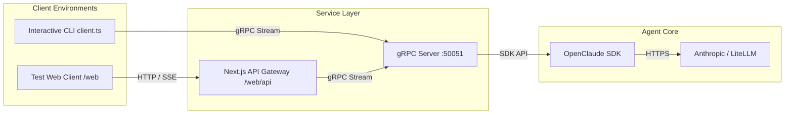

# OpenClaude Server

> Stateful, remote gRPC daemon and orchestration service wrapper for **OpenClaude** coding agent environments.

`openclaude-server` allows you to host stateful OpenClaude coding agents as a headless network service. By exposing a high-performance gRPC interface, it decouples the coding agent engine from the terminal interface, enabling developers to build custom web clients, IDE extensions (e.g., VS Code or Cursor), CI/CD runners, and remote collaborative workspaces.

A Next.js web client is included in the directory structure (`/web`) strictly as a **reference/test application** to demonstrate Server-Sent Events (SSE) stream proxying, session orchestration, and real-time interactive tool permission cards.

---

## Architectural Objectives

* **Protocol Decoupling**: Run the agent environment on a remote server, workspace container, or development VM, and communicate via a lean gRPC client.
* **State Preservation**: Persist, resume, and fork agent sessions across connections.
* **Programmatic Permission Control**: Control agent tool executions (e.g., executing shell commands, modifying source code, searching the web) via remote client confirmations or bypass policies.
* **Prompt Caching Optimization**: Includes a built-in boot-level caching shield that optimizes tokens while using first-party Anthropic API keys.



---

## gRPC Protocol Specification

The service interface is defined in [openclaude.proto](file:///Users/jatinbalodhi/Developer/work/openclaude-grpc/protos/openclaude.proto).

### RPC Services

#### `rpc ListSessions (ListSessionsRequest) returns (ListSessionsResponse)`
Retrieves metadata of historical agent sessions stored on the host (e.g., creation timestamp, Git branch, summary, last modified files, target Workspace directory).

#### `rpc DeleteSession (DeleteSessionRequest) returns (DeleteSessionResponse)`
Tears down and deletes an active or cached session and its associated storage.

#### `rpc GetSessionMessages (GetSessionMessagesRequest) returns (GetSessionMessagesResponse)`
Retrieves the complete message history (user inputs, assistant thoughts, tool outputs, system events) of a specific session.

#### `rpc SessionChat (stream SessionChatRequest) returns (stream SessionChatResponse)`
A bidirectional streaming RPC.
1. **Client writes**:
   * `StartSession`: Creates a new session or resumes an existing one, specifying Workspace directory (`cwd`), model overrides, and `permission_mode`.
   * `UserPrompt`: Dispatches user requests to the agent.
   * `PermissionResponse`: Approves or denies a paused tool execution.
   * `Interrupt`: Halts the current agent iteration loops.
2. **Server yields**:
   * `SessionStarted`: Acknowledges the session ID.
   * `AgentMessage`: Streaming assistant markdown text, status updates, tool invocations, or command output logs.
   * `PermissionRequest`: Requests validation to execute a specific tool (e.g., `Bash` command or `Write` operation).
   * `Finished`: Signals prompt completion.

---

## Project Structure

```text
├── README.md               # Main architectural guide and documentation
├── package.json            # Root configuration and npm scripts
├── tsconfig.json           # Shared TypeScript compiler settings
├── protos/
│   └── openclaude.proto    # gRPC schema definition
├── src/
│   ├── server.ts           # Core gRPC server implementation
│   ├── env-init.ts         # Boot-level caching/beta environment parameters
│   ├── client.ts           # Verification CLI tool client
│   └── test_bypass.ts      # Automated permission-bypass test suite
└── web/                    # Next.js Reference / Test Web App
    ├── package.json
    ├── src/app/page.tsx    # Stream visualizer and sidebar session manager
    ├── src/lib/grpcClient.ts # gRPC node channel pool wrapper
    └── src/app/api/        # Server-Sent Events stream bridge & API endpoints
```

---

## Development Setup

### Prerequisites
* **Node.js** (version 20 or higher)
* An active **Anthropic API Key** (set as `ANTHROPIC_API_KEY`)

### Installation

Install dependencies for the gRPC service and build the TypeScript binaries:

```bash
# Install root daemon dependencies
npm install

# Compile the TypeScript files
npm run build
```

Install the reference/test Next.js dependencies:

```bash
npm install --prefix web
```

---

## Starting the Service

### 1. Run the gRPC Daemon

To start the stateful gRPC server on port `50051`:

```bash
export ANTHROPIC_API_KEY="your-api-key"
npm start
```

### 2. Verify with the Test CLI

You can launch a terminal client to verify server statefulness and bidirectional streaming:

```bash
npm run client
```

### 3. Launch the Reference Test Web UI

To launch the dev server of the reference test dashboard:

```bash
npm run web:dev
```
Open [http://localhost:3000](http://localhost:3000) to view active sessions, test real-time prompt streaming, and mock interactive tool executions.

---

## License

This project is open-source and available under standard open-source licenses.
