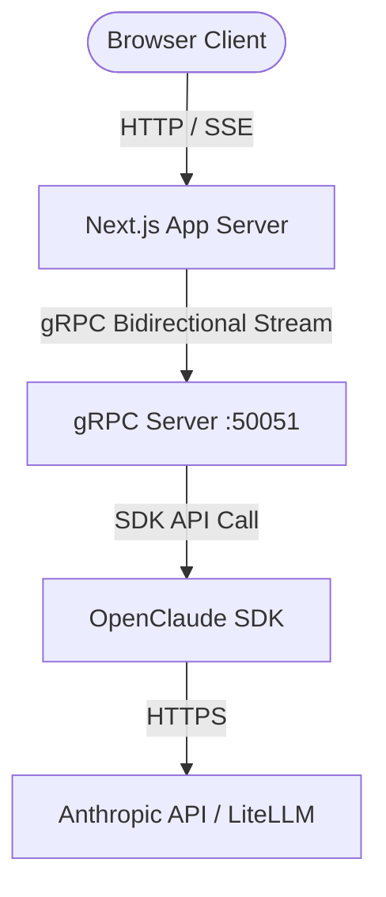

# OpenClaude gRPC Service & Next.js Web UI

An open-source wrapper for hosting and interacting with **OpenClaude** (the model-agnostic coding agent framework) as a stateful, remote gRPC service alongside a premium Next.js Web UI chat client.

---

## Architecture Overview

This project consists of two core components:
1. **gRPC Host Service (Backend)**: Orchestrates `@gitlawb/openclaude/sdk` session instances, intercepts special slash commands locally (such as `/help`, `/mcp`), handles auto-approval/bypass modes, and exposes a bidirectional streaming API.
2. **Next.js Web Chat Client (Frontend & Proxy)**: A rich, glassmorphic dark-themed UI that lists and deletes historical sessions, streams message tokens in real-time, and renders interactive approval cards for tool execution requests.



---

## Directory Structure

* **`protos/`**
  * `openclaude.proto` — Protobuf schema definition exposing the `OpenClaudeService` methods.
* **`src/`**
  * `env-init.ts` — Pre-loads environment variables to prevent prompt caching validation conflicts.
  * `server.ts` — The gRPC server listening on port `50051` with permission-management/auto-allow handlers.
  * `client.ts` — An interactive CLI test client.
  * `test_bypass.ts` — Integration test for validating prompt streaming and permission-bypass capabilities.
* **`web/`**
  * `src/app/page.tsx` — Next.js front page containing sidebar, chat components, and action handlers.
  * `src/app/globals.css` — Custom glassmorphism variables and CSS design system.
  * `src/app/api/chat/route.ts` — SSE gateway proxy forwarding browser events to gRPC stream.
  * `src/app/api/sessions/route.ts` — GET/DELETE endpoints to query historical sessions.
  * `src/app/api/permission-response/route.ts` — REST endpoint to receive user prompt approvals.
  * `src/lib/activeStreams.ts` — In-memory registry mapping client requests to active gRPC streams.

---

## Getting Started

### Prerequisites

* **Node.js** (version 20 or higher)
* An **Anthropic API Key** (or another provider compatible with OpenClaude)

### Installation

Clone the repository and install dependencies in both the root directory and the web folder:

```bash
# Install root gRPC dependencies
npm install

# Install Next.js web application dependencies
npm install --prefix web
```

### Starting the Servers

To start the complete application, you need to run the gRPC server and the Next.js web server.

1. **Launch the gRPC Host Server**:
   ```bash
   # Provide your Anthropic key or appropriate provider credentials
   ANTHROPIC_API_KEY=your-api-key-here npm start
   ```
   The service will listen on `grpc://localhost:50051`.

2. **Launch the Next.js Web Client**:
   ```bash
   npm run web:dev
   ```
   The web portal will boot up on `http://localhost:3000`.

---

## Interactive Walkthrough

Once both servers are running:

1. Open **`http://localhost:3000`** in your browser.
2. **Standard Chat**: Click "+ New Session", type your prompt (e.g. `"Explain the project structure"`), and watch the agent's thoughts stream in real-time.
3. **Bypass Permission Prompts (Auto-Allow)**: Check the **"Bypass Permission Prompts"** checkbox, and ask: `"Create a temporary file named testing.txt containing 'Hello World'"`. The agent runs the file-write tool instantly.
4. **Interactive Permission Prompting**: Turn off the bypass checkbox, and prompt the agent to write a file. A red border card will slide into your chat window (`⚠️ Approval required: Write`). Click **Approve Execution** to resume the agent's work.
